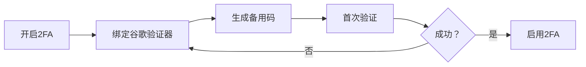

以下是一个更长、结构更完整且符合正常文档习惯的 Markdown 测试文档，包含从 H1 到 H6 的完整标题层级，并配有段落、列表、代码块、引用等典型内容，适合用于渲染测试、样式调试或目录生成验证。

```markdown
# 产品需求文档：用户中心重构项目

> 文档版本：v2.3 | 最后更新：2026-06-05 | 负责人：产品经理 张明

本文档旨在详细描述用户中心模块的前端重构需求，涵盖页面布局、交互逻辑及接口规范。

## 1. 项目背景与目标

当前用户中心页面存在加载缓慢、移动端适配不良等问题。本次重构的核心目标是提升用户体验与代码可维护性。

### 1.1 业务痛点

- 首屏加载时间超过 3 秒，用户流失率上升 15%。
- 多个页面样式未统一，按钮、字体、间距不一致。
- 旧代码基于 jQuery 开发，难以与现代前端框架集成。

### 1.2 预期收益

| 指标 | 当前值 | 目标值 |
|------|--------|--------|
| 首屏加载时间 | 3.2s | ≤1.5s |
| 代码复用率 | 20% | ≥60% |
| 移动端适配覆盖率 | 40% | 100% |

## 2. 功能范围

本次迭代包含以下核心模块，具体见子章节描述。

### 2.1 个人资料面板

用户可在此查看并编辑头像、昵称、性别等信息。

#### 2.1.1 头像上传规则

- 支持格式：JPG、PNG、WEBP
- 大小限制：≤ 5MB
- 推荐尺寸：400×400 像素

> 注意：上传头像需经过实时裁剪与压缩处理，避免前端传输大文件。

##### 2.1.1.1 裁剪组件参数

`cropper` 组件配置示例：

```javascript
const cropperConfig = {
  aspectRatio: 1,
  viewMode: 1,
  autoCropArea: 0.8,
  minCropBoxWidth: 100
};
```

###### 2.1.1.1.1 图像压缩阈值说明（六级标题）

当上传的原始图片分辨率超过 1200×1200 时，前端需将其等比压缩至该阈值以内。压缩算法默认采用 `canvas.toBlob()` 配合 JPEG 质量参数 0.85。此配置可通过后端接口动态下发。

### 2.2 安全设置模块

包含密码修改、登录设备管理及双因素认证开关。

#### 2.2.1 密码强度要求

1. 长度至少 8 位
2. 必须包含大写字母、小写字母、数字
3. 不得包含连续或重复字符（如 123、aaa）

#### 2.2.2 双因素认证流程



## 3. 非功能性需求

本节涉及性能、安全、兼容性等方面的要求。

### 3.1 浏览器兼容性

支持 Chrome 90+、Firefox 88+、Safari 14+，以及 iOS 和 Android 系统内嵌 WebView。

#### 3.1.1 移动端触摸优化

所有可点击元素的最小触摸区域为 44×44 像素，按钮间距不小于 8 像素。

##### 3.1.1.1 响应式断点设置

| 断点名称 | 最小宽度 | 布局调整 |
|----------|----------|-----------|
| 手机 | 0px | 单列 |
| 平板 | 768px | 双列 |
| 桌面 | 1280px | 三列 + 侧边栏 |

###### 3.1.1.1.1 交互手势说明（六级标题）

在移动端，左滑可返回上一级菜单，右滑拉出侧边栏。长按资料卡片超过 500ms 将弹出快捷操作菜单。上述行为已在原型中验证。

## 4. 接口变更记录

后端需配合提供以下新接口。

### 4.1 GET /api/user/profile

返回用户基本信息，字段如下：

```json
{
  "userId": 10086,
  "nickname": "测试用户",
  "avatarUrl": "https://cdn.example.com/avatar.jpg"
}
```

#### 4.1.1 错误码定义

- 1001：Token 过期
- 1002：无权限访问
- 2001：用户不存在

## 5. 测试用例参考

请测试团队重点关注以下场景。

### 5.1 异常场景

- 网络断开时提交表单，应提示“网络异常”
- 并发修改同一字段时，以后端最后收到请求为准

#### 5.1.1 安全测试

尝试上传 .exe 或 .html 文件作为头像，系统应拒绝并提示“文件类型不支持”。

##### 5.1.1.1 性能基准

在 3G 网络模拟条件下，所有接口响应时间不得超过 2 秒。

###### 5.1.1.1.1 最终验收备注（六级标题）

以上所有六级标题节点均为文档最深层级，用于说明极细致的规则或参数。请渲染工具确保字号、粗细、边距与上方五级标题有明显差异。

---
**附录**：相关设计稿链接：[Figma - 用户中心重构](https://figma.com/example)
```

你可以将以上内容直接复制到 `.md` 文件中，使用 Typora、VS Code Markdown 预览、GitHub 或 GitLab 等工具查看各层级的渲染效果。如需继续调整内容长度或侧重点，我可以再为你定制。
